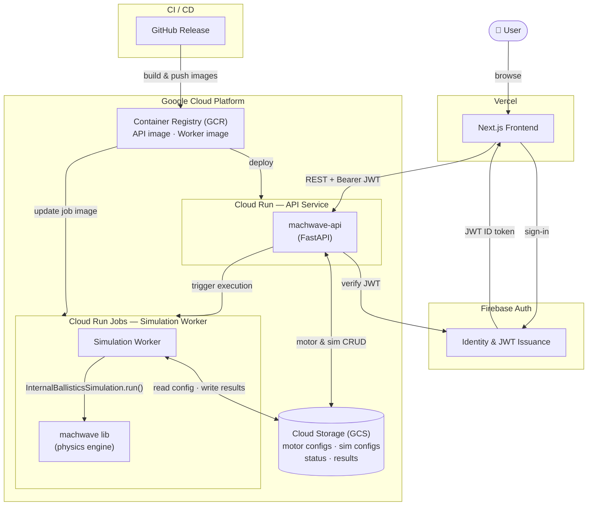

# machwave-api

FastAPI backend for the machwave web platform.

## Architecture



Users authenticate through Firebase. Every API request carries a Firebase ID token verified by the backend. Simulation jobs are dispatched as Cloud Run Job executions; the worker runs the `machwave` physics engine, writes results to GCS, and the API reads them back on demand.

## Main components

| Path | Purpose |
|---|---|
| `app/routers/motors.py` | Motor CRUD — stores configs as JSON in GCS |
| `app/routers/simulations.py` | Trigger + poll simulations via Cloud Run Jobs |
| `app/routers/propellants.py` | Read-only propellant catalogue |
| `app/schemas/` | Pydantic v2 request/response models |
| `app/storage/gcs.py` | Async GCS helpers |
| `app/auth/firebase.py` | Firebase ID token verification |
| `app/worker/run.py` | Cloud Run Jobs entry point |

## Local development

### Prerequisites

- Docker + Docker Compose
- A GCP service account key with roles: `Storage Object Admin`, `Firebase Auth` read, `Cloud Run Jobs` invoker
- A `.env` file (copy `.env.example` and fill in values)
- Place the service account key at `./sa-key.json` (gitignored)

### Run

```bash
cp .env.example .env
# edit .env with your project values
make up
```

API is available at `http://localhost:8000`. Interactive docs at `http://localhost:8000/docs`.

To run the worker manually:

```bash
docker compose run --env SIM_ID=<id> --env USER_ID=<uid> worker
```

## Deployment

Deploy is triggered by creating a GitHub release. The workflow:

1. Runs the test suite
2. Builds and pushes images tagged with the release version to GCR
3. Deploys the API image to Cloud Run
4. Updates the worker Cloud Run Job image

Required GitHub secrets: `GCP_PROJECT_ID`, `GCP_SA_KEY`, `GCS_BUCKET_NAME`, `FIREBASE_PROJECT_ID`, `CORS_ORIGINS`.

## Commands

```bash
make install-dev   # install dependencies (dev)
make test          # run tests
make check         # format check + lint
make format        # auto-format
make up            # start local API with docker compose
make down          # stop
```
